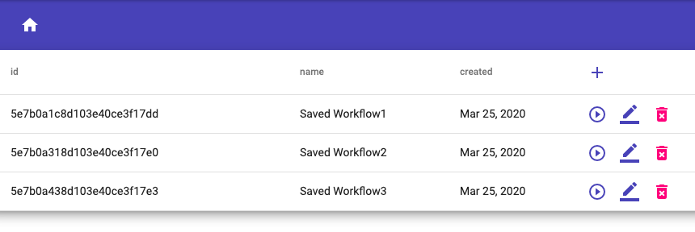
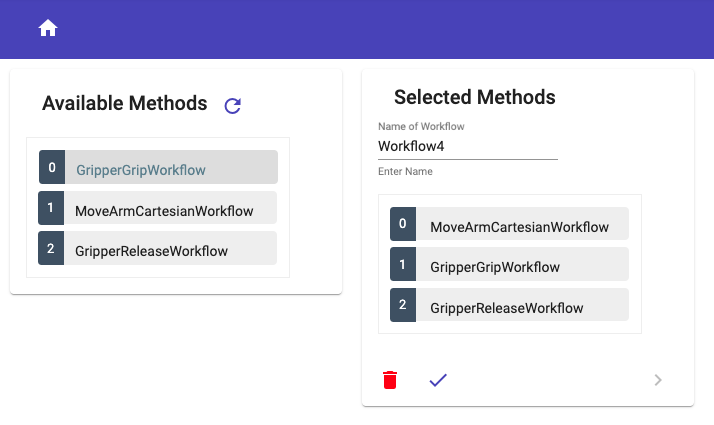
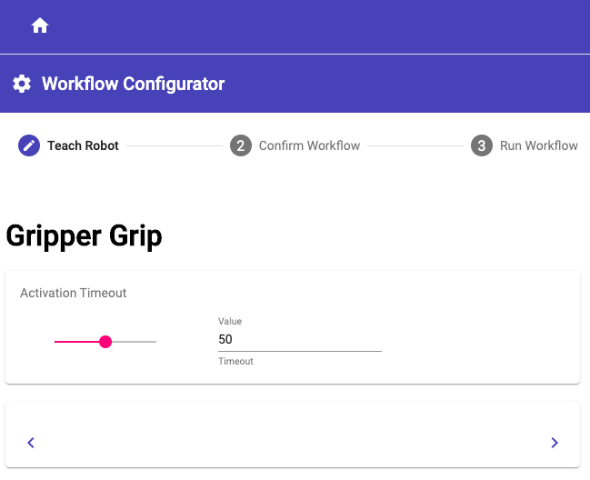
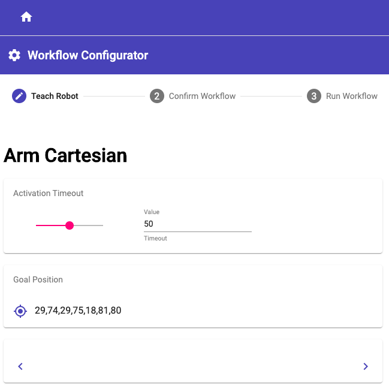
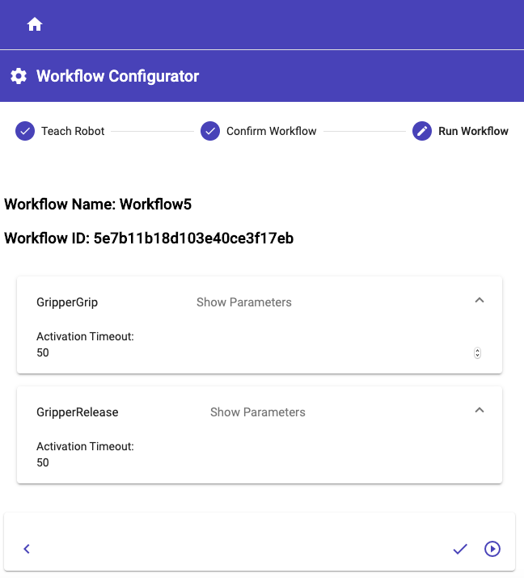
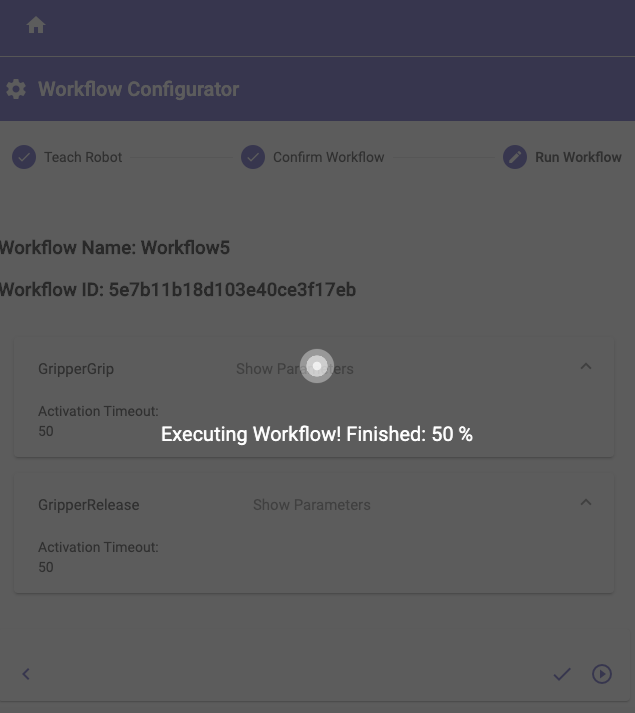

# Robot Teaching 

Robot Teaching is a web-based user interface for programming mobile manipulators like CHIMERA.   
The so-called "Teach-In" procedure is used to program the robot. 

The web application is based on the "MEAN" Stack and stands for   

- M        [MongoDB](https://www.mongodb.com/de)
- E        [Express.js](https://expressjs.com/de/)
- A        [Angular](https://angular.io/guide/architecture)
- N        [Node.js](https://nodejs.org/en/)   

For the documentation of the "Front-End" [Compodoc](https://compodoc.app/) was used.     
Compodoc is a documentation tool for Angular applications. Basically it generates a static documentation for the application. 

For this application the documentation was extended. Under [Additional Documentation](../../additional-documentation/introduction.html) you will find detailed instructions for adding new robot methods. 
In the manner of a tutorial every single step is explained in detail. Screenshots and direct links to the affected code passages help the developer to understand how to extend the program. 

## Components Structure  

In the following, the structure of the components will be illustrated.   

## Workflows Table - Home

## Jobs Selection – Drag and Drop

 

## Configurator - Gripper Grip 

 

## Configurator - Arm Cartesian 

## Confirmed Workflow - Ready for Executing   

 

## Executing Workflow - Progress Display

 

