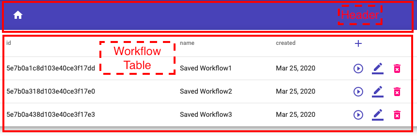
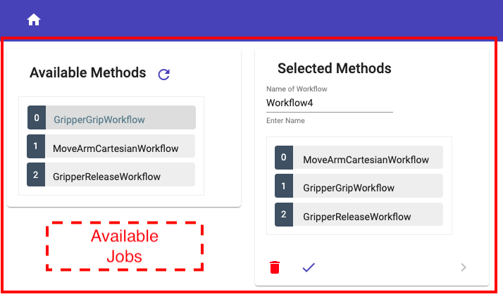
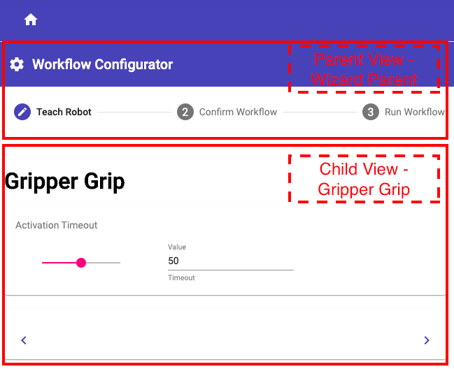
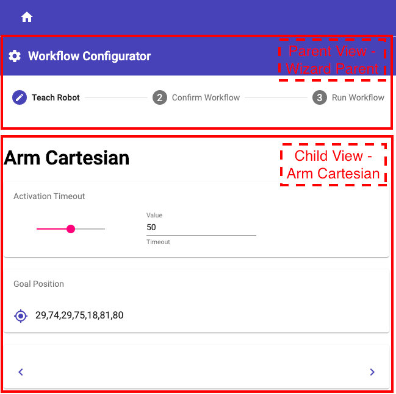
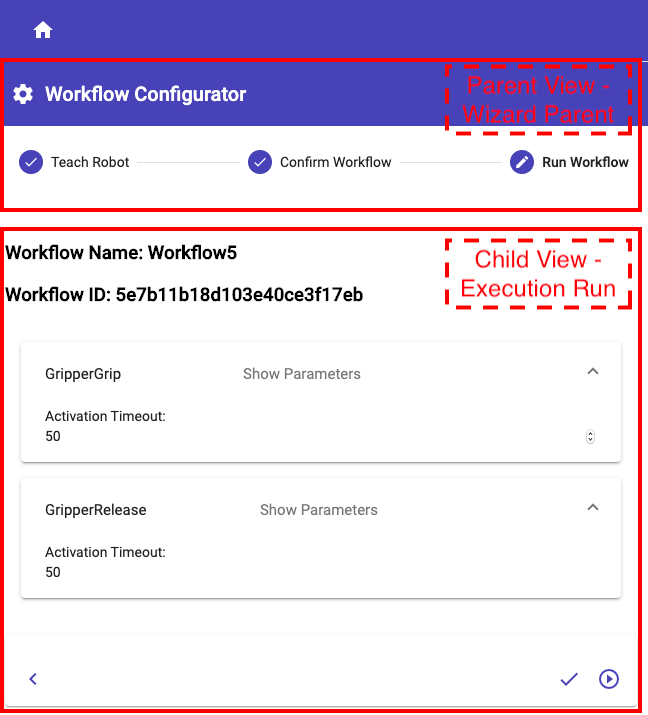

# Robot Teaching 

Robot Teaching is a web-based user interface for programming mobile manipulators like CHIMERA.   
The so-called "Teach-In" procedure is used to program the robot. 

The web application is based on the "MEAN" Stack which stands for   

- M        [MongoDB](https://www.mongodb.com/de)
- E        [Express.js](https://expressjs.com/de/)
- A        [Angular](https://angular.io/guide/architecture)
- N        [Node.js](https://nodejs.org/en/)   

For the documentation of the "Front-End" [Compodoc](https://compodoc.app/) was used.     
Compodoc is a documentation tool for Angular applications. Basically it generates a static documentation for the application. 

For this application the documentation was extended. Under [Additional Documentation](../../additional-documentation/introduction.html) you will find detailed instructions for adding new robot methods. 
In the manner of a tutorial every single step is explained in detail. Screenshots and direct links to the affected code passages help the developer to understand how to extend the program. 

To install Compodoc enter   

> npm install -g @compodoc/compodoc  
  
in terminal. A detailed description you find [here](https://compodoc.app/guides/installation.html).    
If you change the code and want to generate an updated documentation enter:

  
> compodoc -p tsconfig.json -s -a screenshots --includes additional-doc  
    
This command also includes the part of the [Additional Documentation](../../additional-documentation/introduction.html) in the updated documentation.  

   
# Components Structure  

In the following, the structure of the components will be illustrated.   

## Workflows Table - Home

Link to [Header](../../components/HeaderComponent.html) component.   
   
Link to [Workflow Table](../../components/WorkflowTableComponent.html) component.      

## Jobs Selection – Drag and Drop

 

Link to [Available Jobs](../../components/AvailableJobsComponent.html) component.   

## Configurator - Gripper Grip 

   

Link to [Wizard Parent](../../components/WizardParentComponent.html) parent component. 

Link to [Wizard Gripper Grip](../../components/WizardGripperGripComponent.html) child component.  

## Configurator - Arm Cartesian 

    

Link to [Wizard Parent](../../components/WizardParentComponent.html) parent component.   

Link to [Wizard Arm Cartesian](../../components/WizardArmCartesianComponent.html) child component.    

## Confirmed Workflow - Ready for Executing   

    

Link to [Wizard Parent](../../components/WizardParentComponent.html) parent component.    

Link to [Execution Run](../../components/ExecutionRunComponent.html) child component.    

## Executing Workflow - Progress Display

 

Link to [Execution Run](../../components/ExecutionRunComponent.html) component.   
    

              

