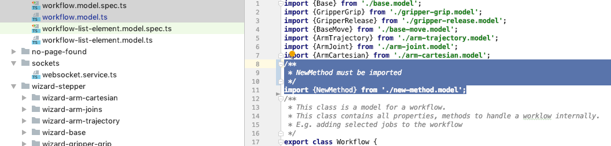
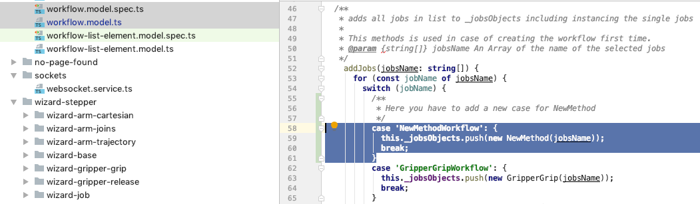
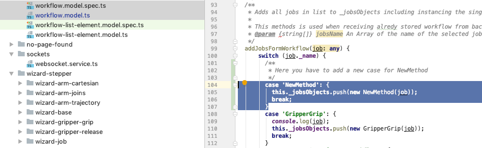

# Add NewMethod to Workflow Model 

In the model folder update the class workflow.   

1. Import NewMethod 

2. Add NewMethod to addjobs(...)

3. Add NewMethod to addJobsFormWorkflow(...) 

Link to class [NewMethod](../../classes/Workflow.html).
