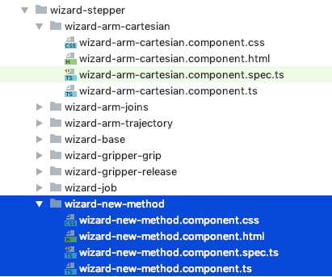
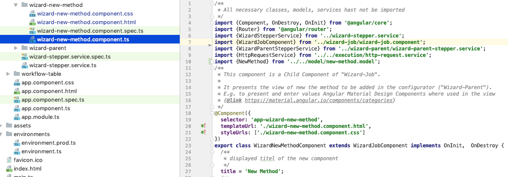
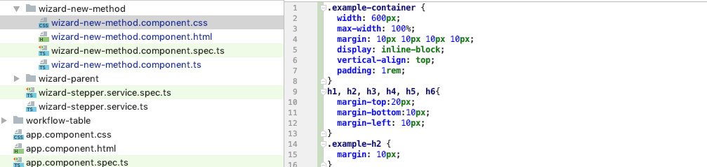

# Creation of view component for new robot method  

1. Create a new component for the new robot method within "wizard-stepper" folder.     

    

2. Adjust "wizard-new-method.component.ts" Typysript file - e.g. copy paste from other component     

    

3. Adjust "wizard-new-method.component.css" CSS file - e.g. copy paste from other component    

   

4. Adjust "wizard-new-method.component.html" Html file - e.g. copy paste from other component    

   

Link to component [WizardNewMethodComponent](../../components/WizardNewMethodComponent.html).   
