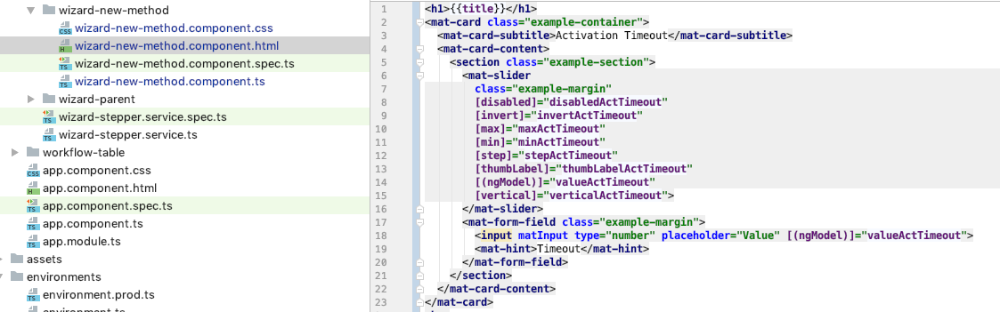

# Creation of new component for new robot method  

1. Create [new component](../../components/WizardNewMethodComponent.html) for the new robot method within directory "src/app/wizard-stepper/".     

    

2. Adjust "src/app/wizard-stepper/wizard-new-method/wizard-new-method.component.ts" Typysript file - e.g. copy paste from other component     

    

3. Adjust "src/app/wizard-stepper/wizard-new-method/wizard-new-method.component.css" CSS file - e.g. copy paste from other component    

   

4. Adjust "src/app/wizard-stepper/wizard-new-method/wizard-new-method.component.html" Html file - e.g. copy paste from other component    

  
   

      

