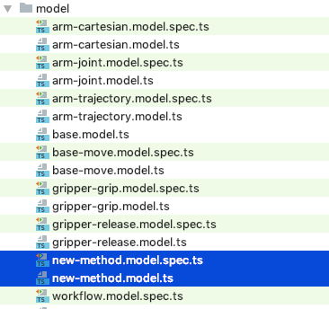
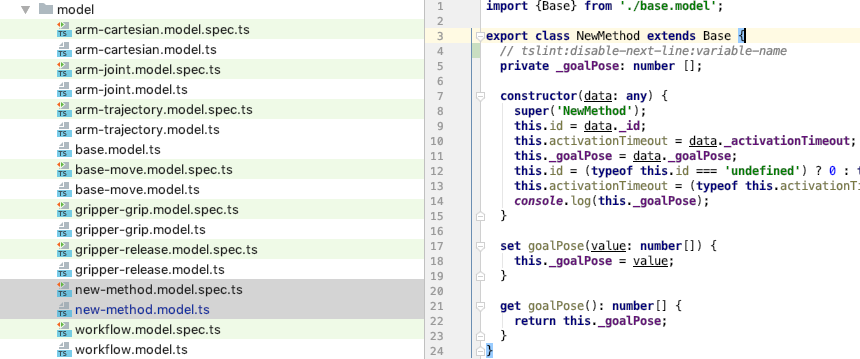

# Creation of a NewMethod model   
    

1. Create a new class respectively model for the [new robot method](../../classes/NewMethod.html) within directory "src/app/model/".      
      
   
         
      

2. Adjust "src/app/model/new-method.model.ts" Typysript file - e.g. copy paste from other model   
     
    
     
   

