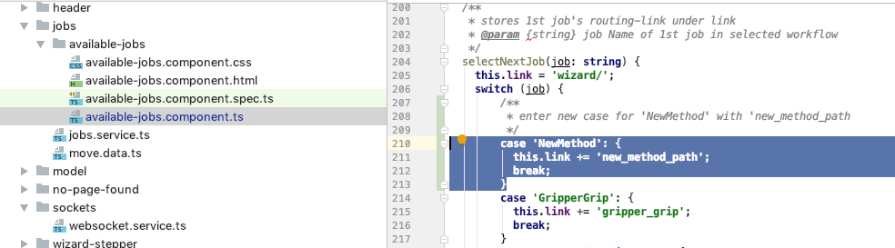
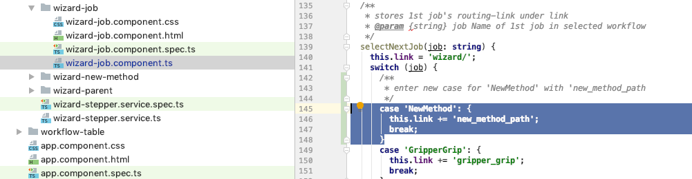

# Update selectNextJob(...) methods in two Components
           

1. Open [available jobs component](../../components/AvailableJobsComponent.html) within "jobs/available-jobs/available-jobs.component.ts" folder.   
   
2. Add 'new_method_path' in selectNextJob(...) in "available-jobs.component.ts"     
  
   
          
3. Open [wizard job component](../../components/WizardJobComponent.html) within "wizzard-step/wizzard-job/wizard-job.component.ts" folder.    
   
4. Add 'new_method_path' in selectNextJob(...) in "wizard-job.component.ts"     
  
     
     
  
  
 
  