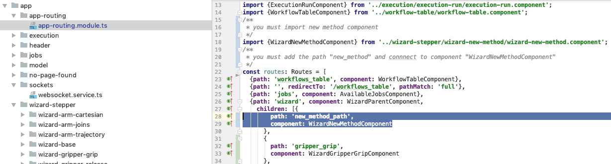

# Adding routes to new method component 

Go to foler "app-routing" and open "app-routing.module.ts".   
Add a new path: "new_method_path" and link to component: "WizardNewMethodComponent".  
  

  

Link to Routing Module [AppRoutingModule](../../modules/AppRoutingModule.html).
